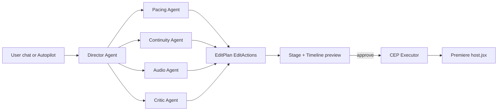

## North star

Today the panel is a settings dashboard with ~10 stacked cards in a 3,000+ line `src/pages/Index.tsx`. That is not a video editor. We rebuild the surface around an **editor IDE** layout (Stage + Timeline + Chat) and a **shared agentic edit-core** that is portable to a future standalone web preview. Premiere CEP stays the real execution runtime; the new core just emits structured `EditAction[]` that Premiere applies atomically.

What the user sees by default is now: a preview canvas, a scrubbable timeline, a chat sidebar, and one big "Autopilot" button. Every existing setting moves behind contextual disclosure (Inspector + Settings drawer). Nothing else.

## Architecture at a glance



The agents share one Ollama/Gemini router (already in [src/lib/ai/router.ts](src/lib/ai/router.ts)). Every proposal is an `EditPlan` diff that renders in the in-panel timeline **before** anything touches Premiere.

---

## 1. New UI shell (replaces the card-stack)

Default screen is one app, not twelve cards. Built under a new `src/features/editor/`:

- `EditorShell.tsx` — top bar (project status, Autopilot CTA, export), three-pane body, bottom timeline. Replaces the entire layout currently in [src/pages/Index.tsx](src/pages/Index.tsx) lines ~1850–3035.
- `StageCanvas.tsx` — preview surface. Renders the current placement's image/video thumbnail (already produced by [src/lib/media.ts](src/lib/media.ts) + media scan), playhead, transport (play / step / mark in-out). Reads `previewPlan` directly from the edit-core store.
- `TimelineDeck.tsx` — multi-track ribbon (V2/V1/A1/A2/Captions). Each chip = a `TimelinePlacement` from existing [src/lib/timeline-plan.ts](src/lib/timeline-plan.ts). Selecting a chip drives the Inspector.
- `ChatAgent.tsx` — right pane. Free-form chat. Each user message routes through `chat-router` agent (below) → emits a previewable `EditAction[]` diff in the timeline → user clicks Apply.
- `Inspector.tsx` — context-aware right pane: shows clip details + per-clip overrides when a chip is selected; falls back to the chat agent when nothing is selected.
- `AutopilotBar.tsx` — top bar with the single primary CTA ("Autopilot full edit") + status pill (provider/model, sequence, range).
- `SettingsDrawer.tsx` — slide-out drawer that hosts every existing card (`WorkflowModeCard`, `DirectorControlsCard`, advanced AI controls, silence cleanup controls, asset inbox, missing asset plan, agent handoff, workflow QA). They stay available, but they are no longer the front page.

`src/pages/Index.tsx` becomes a thin mount: state store + `<EditorShell />`. We extract the existing state (settings, plan memos, handlers) into focused hooks under `src/features/editor/hooks/` (`useEditorStore`, `useAutopilot`, `useChatAgent`, `useTimelineSelection`).

UI principles enforced:
- Default visible controls: script source, media folder, creator profile, target track, Autopilot. That's it.
- "Advanced" is one button that opens `SettingsDrawer`.
- Cards stop stacking; they live inside the drawer as tabs.

## 2. Shared edit-core (portable to web preview later)

New folder `src/lib/edit-core/` — pure TS, zero Premiere coupling.

- `types.ts` — canonical schema:
  ```ts
  type EditAction =
    | { kind: "place_clip"; placementId; track; startSec; endSec; mediaPath }
    | { kind: "trim_clip"; placementId; newStartSec; newEndSec }
    | { kind: "cut_silence"; spans: SilenceSpan[]; audioTrackIndex }
    | { kind: "set_audio_level"; trackIndex; dbKeyframes: AudioKeyframe[] }
    | { kind: "duck_under_voice"; musicTrackIndex; voiceTrackIndex; duckDb }
    | { kind: "normalize_loudness"; trackIndex; targetLufs }
    | { kind: "add_transition"; placementId; style: TransitionStyle; durationSec }
    | { kind: "add_caption_run"; words: CaptionWord[]; style: CaptionStyle; track }
    | { kind: "speed_ramp"; placementId; curve }
    | { kind: "punch_in"; placementId; scalePct; durationSec }
    | { kind: "color_match"; placementId; referencePath }
    | { kind: "reorder_segments"; order: string[] }
    | { kind: "export"; preset: ExportPreset };

  interface EditPlan {
    id; createdAt; basedOnPlanId?;
    actions: EditAction[];
    rationale: AgentDeliberation[];   // who said what, why
    diffFrom?: EditPlan;              // for chat refinement previews
  }
  ```
- `plan-builder.ts` — converts the existing `TimelinePlacement[]` and silence preview into an initial `EditPlan`.
- `plan-diff.ts` — computes adds/changes/removes between two plans for the preview UI.
- `autopilot.ts` — orchestrator (see §3).
- `executor.ts` — translates `EditAction[]` → existing `executeTimelineJob` + `executeSilenceCleanup` calls in [src/lib/cep.ts](src/lib/cep.ts), plus new bridges for captions/audio (§4).
- `creator-profile.ts` — persists user likes/dislikes/overrides per placement; feeds an extra signal into [src/lib/ai/generated-asset-reranker.ts](src/lib/ai/generated-asset-reranker.ts).

This is the boundary that makes a future standalone web preview cheap: the same `EditPlan` can be rendered with WebCodecs without the CEP executor.

## 3. Autopilot pipeline (one button → finished edit)

New `src/lib/edit-core/autopilot.ts` runs this chain:

1. **Ingest** — load Premiere markers via existing `getPremiereTranscriptSegments`, scan media via `listMediaFiles`, profile assets via `indexMediaLibraryForAi`.
2. **Silence cut** — `previewSilenceCleanup` → critic agent reviews → `executeSilenceCleanup`.
3. **Story pass** (new) — Story agent flags filler/repeats and proposes `reorder_segments` actions (preview only, user must approve).
4. **B-roll assembly** — existing `buildTimelinePlan` + `profileAssetsWithAi` + `rerankGeneratedAssetsForPlacements`, now wrapped behind a Director agent (§5).
5. **Audio polish** (new) — `normalize_loudness` (LUFS −14 social / −16 podcast) + `duck_under_voice` keyframes computed from voice track RMS.
6. **Captions** (new) — word-level timing from existing transcript, emits `add_caption_run` action set with chosen style.
7. **Critic pass** — final critic agent runs `buildWorkflowQaReport` on the proposed `EditPlan`, surfaces warnings inline.
8. **Preview + apply** — UI shows the resulting diff on the timeline; user hits "Apply" → `executor.run(plan)`.

Each stage is independently re-runnable from chat ("re-do audio polish", "just regen captions").

## 4. New executor bridges (CEP / `premiereHost.jsx`)

Extend [cep/com.soragenie.panel/host/premiereHost.jsx](cep/com.soragenie.panel/host/premiereHost.jsx) with new handlers (mirroring the existing `runJob`/`applySilenceCleanup` pattern). All payloads stay file-batched (`runJobFromFile`) so we keep the existing transactional model:

- `applyAudioPolish` — writes rubber-band audio level keyframes on selected tracks (LUFS normalize + voice ducking). Uses `clip.components` audio gain.
- `applyCaptions` — inserts Essential Graphics text generators on a dedicated caption track, one per word run. Uses `qe.project.getActiveSequence().videoTracks[N].insertClip` with a generated MOGRT template; fallback to `addItem` with title clips if MOGRT API is missing.
- `applyColorMatch` — sets Lumetri preset properties on selected clips (clamped scope).
- `applyTransitions` — `sequence.videoTransitions.insertTransition` between adjacent placements.
- `applyExport` — `app.encoder.encodeSequence` with selected preset.

Mirror calls in [src/lib/cep.ts](src/lib/cep.ts):
```52:60:src/lib/cep.ts
// existing executeTimelineJob / executeSilenceCleanup pattern
```
becomes `executeAudioPolish`, `executeCaptions`, `executeColorMatch`, `executeTransitions`, `executeExport`. All routed through the new `executor.ts`.

FFmpeg dependency: we already detect it in [src/lib/ai/video-preprocessing.ts](src/lib/ai/video-preprocessing.ts). Add `src/lib/audio/ffmpeg-bridge.ts` for offline loudness measurement (`ffmpeg -filter:a loudnorm -f null`) and ducking sidechain RMS analysis. If ffmpeg missing, executor still runs but uses Premiere's built-in normalize.

## 5. Multi-agent council (Ollama-backed)

New `src/lib/ai/agents/` with one file per role. Each agent is a thin wrapper around the existing router:

- `director.ts` — orchestrator. Composes the full `EditPlan`, calls specialist agents, resolves conflicts.
- `pacing.ts` — judges shot lengths / rhythm against the chosen pacing preset. Emits `trim_clip`, `speed_ramp`.
- `continuity.ts` — checks asset reuse, story flow, scene-to-scene logical coherence. Emits `reorder_segments`, swap suggestions.
- `audio.ts` — proposes `cut_silence`, `normalize_loudness`, `duck_under_voice`.
- `critic.ts` — final QA, blocks low-confidence placements, summarizes risk before apply.
- `chat-router.ts` — converts the user's free-form chat ("make the intro faster", "punch in here", "replace weak B-roll", "more cinematic") into a structured intent → routes to the right specialist(s) → returns an `EditPlan` diff. **Always preview-only; never auto-applies.**

Every agent emits an `AgentDeliberation { agent, claim, evidence, confidence }` record. The Chat panel renders this as a collapsible "reasoning trail" so the user can see the council's debate (the agentic experience the user asked for).

Models: keep Ollama primary, Gemini fallback — already implemented. The agents are just specialized prompt templates + JSON schemas, reusing [src/lib/ai/router.ts](src/lib/ai/router.ts) and [src/lib/ai/ollama.ts](src/lib/ai/ollama.ts).

## 6. Timeline Chat Agent (the differentiator)

`src/features/editor/ChatAgent.tsx` + `src/lib/ai/agents/chat-router.ts`.

Flow:
1. User types: "tighten silence to 200ms and punch in on every claim".
2. `chat-router` returns intent JSON: `{ ops: [{kind:"cut_silence", minSilenceSec:0.2}, {kind:"punch_in", target:"editorial_role=proof"}] }`.
3. `autopilot.replan(plan, intent)` produces a new `EditPlan`.
4. UI renders the diff on top of the existing timeline (added/removed chips highlighted).
5. User clicks **Apply** to commit; **Discard** to revert.

This is what makes the panel feel like Descript + Cursor for video. The user never has to touch Premiere's edit tools.

## 7. Creator profile (preferences that learn)

`src/lib/edit-core/creator-profile.ts` persists:
- liked / disliked placement IDs + their semantic profiles
- accepted vs rejected chat suggestions
- preferred pacing per edit goal

Profile is loaded into every agent prompt as a `creatorPreferences` block, and into the reranker as an extra score axis (positive weight for matches similar to liked items). Stored in `localStorage` keyed by `weave-edit-creator-profile`.

## 8. Refactor / cleanup

- Split [src/pages/Index.tsx](src/pages/Index.tsx) (3,035 lines) into:
  - `src/features/editor/EditorShell.tsx`
  - `src/features/editor/hooks/useEditorStore.ts` (settings + state, reuses existing `StoredSettings`)
  - `src/features/editor/hooks/useAutopilot.ts`
  - `src/features/editor/hooks/useChatAgent.ts`
  - `src/features/editor/hooks/useTimelineSelection.ts`
- `Index.tsx` becomes ~30 lines: providers + `<EditorShell />`.
- All old cards keep their files; they're imported only inside `SettingsDrawer.tsx`. No behavior loss.
- Add `tests/edit-core/*.test.ts` for `plan-builder`, `plan-diff`, `executor` payload translation (Vitest).

## 9. Competitor benchmarks we explicitly meet or beat

- **Descript / Opus Clip** — text-driven editing → Chat Agent + transcript-led placements (already partial; now end-to-end).
- **Submagic / CapCut auto-captions** — `add_caption_run` with word-level animated styles.
- **Adobe Sensei "Enhance Speech"** — Audio Polish step (LUFS + duck + silence).
- **Runway Act / Magic Cut** — multi-agent council debating before applying.
- **Premiere AI Auto-Edit** — Autopilot end-to-end with deliberation transparency Premiere does not show.

## Out of scope for v1 (called out so we don't drift)

- Vertical/Shorts auto-reframe with subject tracking (v2, needs FFmpeg + face detection).
- TTS voice cloning (v2, requires external service choice).
- Standalone web editor execution path — v1 only ships the **shared core**; the web app keeps preview-only.
- Stock B-roll fetch (Pexels/Sora hooks) — v2.
- UXP migration — stay on CEP for v1 to ship in days, not weeks.

## Risks worth flagging

- Caption insertion via ExtendScript is fragile across Premiere versions; we ship MOGRT-template path + title-clip fallback and test both.
- Multi-agent loops with Ollama can be slow on weak local models — autopilot must cap deliberation at 1 round per agent unless user clicks "Deepen".
- The diff-preview must be the ONLY apply path; any agent that bypasses it is a regression.
